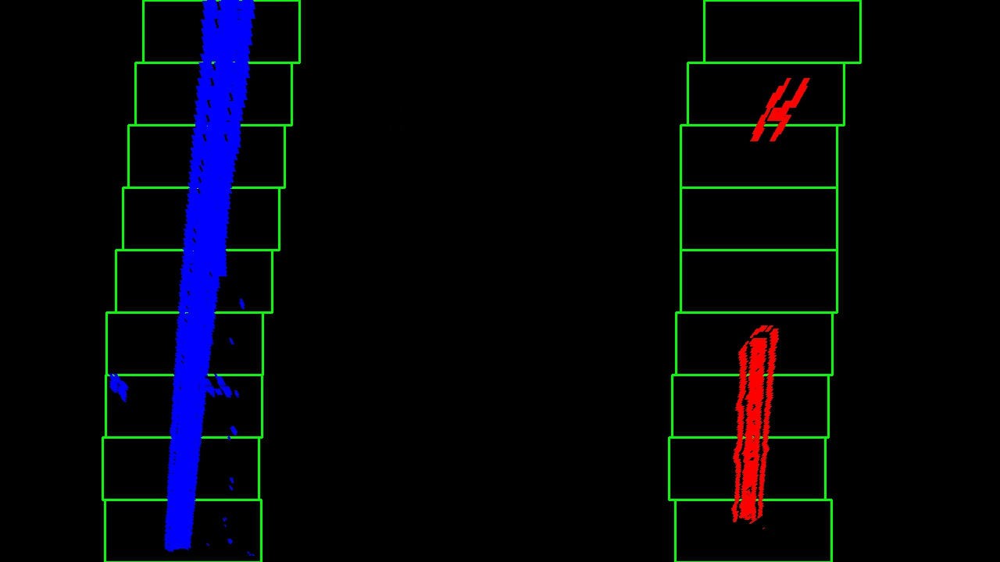
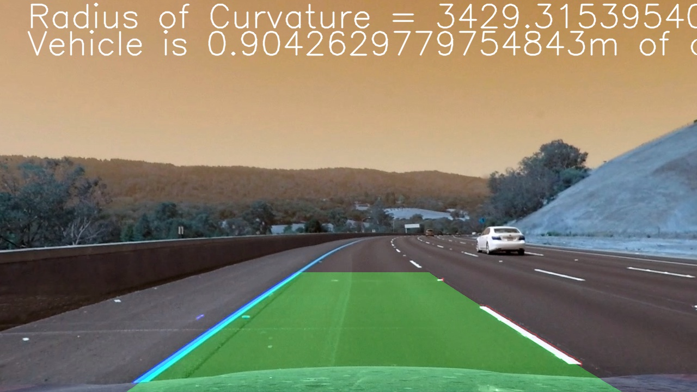

# **Finding Lane Lines Advance** 

---

## Pipline
* Calibration camera and undistortion image
	- calibration matrix (**mtx** and **dist**) can be saved using pickle, no need to go through all chessboard images every time.
* Thresholding
	- absolute sobel
	- magnitude gradient
	- direction of gradient
	- HLS thresholding
	- comined
* Use histogram and sliding window to find lane lines pixcels.
* Fit polynomial
* Use polynomial parameters to calculate curvature. 
* Sanity check
	- check if right curvature is similar to left curvature
	- check if min(right_x) > max(left_x)
* Draw result on image
* Next frame, skip the line searching if found lines last time. +/- your margin from your polynomial lines
	- if sanity check not pass, reset the lane search using sliding window algorithm.

---

## Results
### [Test Images Results](test_images_output)
**example**

