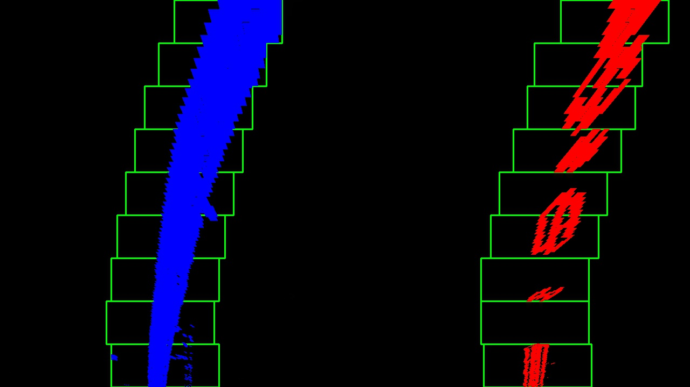
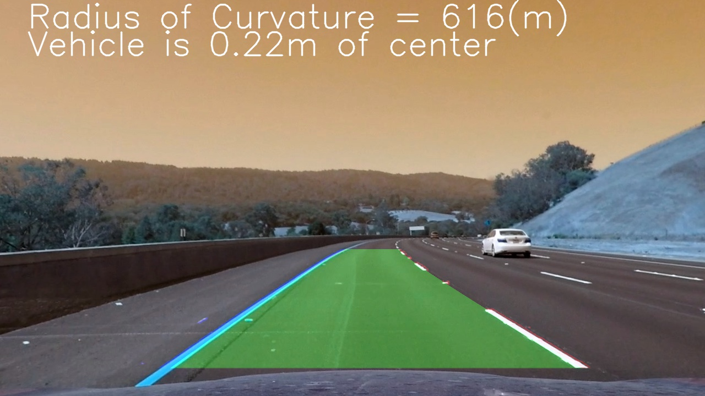

# **Finding Lane Lines Advance** 

---

## Pipline
* **Calibration camera**
	- calibration matrix (**mtx** and **dist**) can be saved using pickle, no need to go through all chessboard images every time.
	```python
	ret, corners = cv2.findChessboardCorners(img, (nx,ny), None) # find chessboard corners
	ret, mtx, dist, rvecs, tvecs = cv2.calibrateCamera(objpoints, imgpoints, img_shape, None, None)
	```
* **undistortion image**
	```python
	img_undistort = cv2.undistort(img, mtx, dist, None, mtx)
	```
* **Thresholding**
	- absolute sobel
	```python
	sobel = cv2.Sobel(gray, cv2.CV_64F, 1, 0, ksize = sobel_kernel)
	```

	- magnitude gradient
	```python
	gradmag = np.sqrt(sobelx**2 + sobely**2)
	```

	- direction of gradient
	```python
	abs_grad_dir = np.arctan2(abs_sobely, abs_sobelx)
	```

	- HLS thresholding
	```python
	hls = cv2.cvtColor(img, cv2.COLOR_RGB2HLS)
    s_channel = hls[:,:,2]
	```

	- comined
	```python
	# How to thresholding
	img[(mask >= thresh[0]) & (mask <= thresh[1])] = 1
	```

* **Use histogram and sliding window to find lane lines pixcels**
[Refer to python code of "Find the Lines with Histogram and Sliding Window"](AdvancedLaneFinding.ipynb)

* **Fit polynomial**
```python
left_fit = np.polyfit(lefty, leftx, 2) #second order polynomial
```
* **Use polynomial parameters to calculate curvature**
**Rcurve = (1+(2Ay+B)^2)^1.5 / |2A|**
```python
# Define conversions in x and y from pixels space to meters
ym_per_pix = 30/720 # meters per pixel in y dimension
xm_per_pix = 3.7/700 # meters per pixel in x dimension
left_curverad = ((1 + (2*left_fit[0]*y_eval*ym_per_pix + left_fit[1])**2)**1.5) / np.absolute(2*left_fit[0])
right_curverad = ((1 + (2*right_fit[0]*y_eval*ym_per_pix + right_fit[1])**2)**1.5) / np.absolute(2*right_fit[0])
```

* **Sanity check**
	- check if right curvature is similar to left curvature
	- check if min(right_x) > max(left_x)

* **Draw result on image**

* **Next frame, skip the line searching if found lines last time. +/- your margin from your polynomial lines**
[Refer to python code of "Look-Ahead Filter"](AdvancedLaneFinding.ipynb)
	- if sanity check not pass, reset the lane search using sliding window algorithm.

---

## Results
### [Test Images Results](test_images_output)
**example**




### [Project Video Output](https://youtu.be/lNBVuSydREM)

---

## 2. Identify potential shortcomings with your current pipeline

One shortcoming in my current work is the 4 corners selection before perspective transform. For now, I manually choose 4 pixcels in the image by observation, however, it should not be best way to do that. 
1. It takes time to try different src and dst pixcels.
2. It just depends on a single image condition. If the road type change (ex. big curve) or use other video or image, the current corners won't work.

---

## 3. Suggest possible improvements to your pipeline

A possible improvement would be using hough transfer to find the line, extend the line until ROI and use the start and end point of the extended line as corners. 